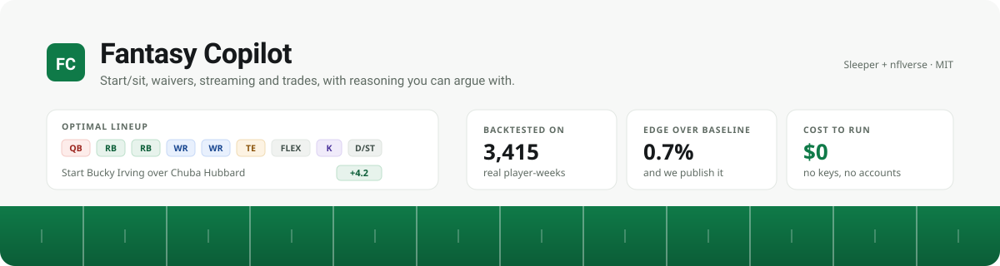

# Fantasy Copilot

[](https://github.com/nsirivolu27/fantasy-copilot/actions/workflows/ci.yml)
[](./LICENSE)
[](./CONTRIBUTING.md)

Your league, your data, your machine. Paste a Sleeper league ID and Fantasy Copilot pulls every
roster, projects every player in **your** scoring, and tells you who to start, who to grab, and
whether that trade is actually good, with the reasoning shown so you can argue with it.

Built on free public data. **No paid APIs. No API keys. Nothing to buy.**

It also tells you when it does not know. The projection model is 0.7% better than a season
average, and that number is published inside the app rather than hidden.

## 🏈 Kick off

Pick one. All three take a few minutes.

### Replit, no install

[](https://replit.com/new/github/nsirivolu27/fantasy-copilot)

Click, then press Run. The committed `.replit` creates the database and starts the server.
Details and the Postgres switch for deploying: [REPLIT.md](./REPLIT.md).

### Docker, one command

```bash
git clone https://github.com/nsirivolu27/fantasy-copilot.git
cd fantasy-copilot
docker compose up -d
```

Postgres and the app both come up on http://localhost:3000.

### Local Node

```bash
git clone https://github.com/nsirivolu27/fantasy-copilot.git
cd fantasy-copilot
npm install
cp .env.example .env
npm run db:push
npm run dev
```

SQLite by default, so there is no database to set up.

## 📋 Your first five minutes

1. Open **Settings**, paste your Sleeper league ID, press **Sync league**.
   It is the long number in your league URL: `sleeper.com/leagues/`**`<this number>`**`/team`
2. Pick which synced team is yours.
3. Press **Refresh projections**. This pulls a season of nflverse stats, derives bye weeks and
   stores the schedule, which lights up `/lineup`, `/waivers` and `/streaming` at once.
4. Optional: add a model under **AI model** to enable chat. Groq has a free tier.

Check the format line on the league page. It should describe your league back to you, for example
`12-team, PPR, 1QB, 1 flex`. That line drives every value in the app, so if it is wrong, say so
before trusting anything else.

**No league ID handy?** `SLEEPER_FIXTURES=1 npm run dev` and use league ID `1124839284756483920`.
The whole sync path runs off `fixtures/`, no network needed.

## 📊 What you get

| Page | What it does |
|---|---|
| `/` | Your roster with projections, and the problems worth acting on today |
| `/league` | Standings, power rankings, win probabilities, playoff odds, weekly digest |
| `/lineup` | Current vs optimal lineup, what each change is worth, coin flips labelled |
| `/waivers` | Free agents ranked by what they add to *your* lineup, with FAAB bids |
| `/streaming` | QB/TE/K/DST planned three weeks ahead by matchup |
| `/chat` | Ask about your league; answers grounded in tool calls, never invented |
| `/model` | The projection model's real accuracy, including where it is weak |

Plus an [MCP server](./MCP.md) so Claude Desktop or Cursor can query your league directly.

### Any league format, no configuration

Nothing about scoring or roster shape is hardcoded. Scoring values, roster slots, team count,
playoff settings and the current week all come from your league, and **replacement level is
derived from them** rather than assumed. So a superflex league correctly makes quarterbacks
scarce, a 14-team league values depth higher than a 10-team one, and TE premium changes tight end
values, all with no configuration.

## 🚀 Hosting it for other people

Running it for yourself needs no accounts at all. Hosting it for your league, or for strangers,
does. Set `REQUIRE_AUTH=1` and the app grows a sign-up and sign-in flow:

- **The first account always succeeds and becomes the owner**, so a fresh deployment can be
  claimed by whoever sets it up.
- **After that, signups are closed by default.** Open them with `ALLOW_SIGNUPS=1`, or hand your
  league an `INVITE_CODE`. A hosted app should not start accepting strangers because nobody
  remembered to lock it.
- Passwords are hashed with scrypt from `node:crypto`, so there is no native dependency to build.
  Session cookies are `httpOnly` and only their hash is stored, so a database leak yields no
  usable logins.
- There is **no password reset yet**, because the app sends no email and adding a mail provider
  would break the no-paid-services promise. The owner can reset one directly in the database.

Where to run it:

| | |
|---|---|
| **[REPLIT.md](./REPLIT.md)** | Replit, fastest path from nothing to running |
| **[DEPLOYING.md](./DEPLOYING.md)** | Vercel, Docker, Railway, Render, Fly |
| **[AWS.md](./AWS.md)** | Production AWS: Fargate, RDS, ECR, CDK in `infra/` |

## ✅ Tests

```bash
npm test        # 118 checks, no database and no network needed
npm run backtest 2024   # measure the projection model against a real season
```

## 🗺️ Roadmap

| Phase | What lands | Status |
|---|---|---|
| 1 | Foundation, adapter boundary, Sleeper league sync | ✅ Done |
| 2 | nflverse ingest, player resolution, projection model, backtest | ✅ Done |
| 3 | Start/sit optimizer, bye and injury alerts | ✅ Done |
| 4 | Waiver targets, FAAB bids, streaming planner | ✅ Done |
| 5 | Trade engine, value providers, "find me a trade" | ✅ Done |
| 6 | League hub: power rankings, playoff odds, weekly digest | ✅ Done |
| 7 | ESPN + manual/CSV adapters | ⬜ |
| 8 | Tool registry + retrieval layer + configurable LLM (any provider) | ✅ Done |
| 9 | League chat, grounded in tools and retrieval | ✅ Done |
| 10 | MCP server, query your league from any AI client | ✅ Done |
| 11 | Decision Leverage (Δ win%) + published calibration | ⬜ Next |
| 12 | Fitted projection model + season learning loop | ⬜ |
| 13 | Polish | ⬜ |
| Extra | Deployable: Postgres, Docker, health check, scheduled sync, site lock | ✅ Done |
| Extra | Bye weeks derived from the nflverse schedule | ✅ Done |
| Extra | Accounts: sign-up, sign-in, owner claim, invite codes | ✅ Done |

## 📉 What the backtest says

The projection model was tested against the **real 2024 nflverse season 3,415
player-weeks**: and the numbers are published in the app at `/model`, including the ones
that don't flatter it. Mean absolute error, fantasy points per game, full PPR:

| | This model | Last week's points | Season average |
|---|---|---|---|
| QB | **5.98** | 7.47 | 6.14 |
| RB | **4.97** | 5.98 | 5.00 |
| WR | **5.03** | 6.41 | 5.03 |
| TE | **3.96** | 5.17 | 3.98 |
| **All** | **4.90** | 6.17 | 4.94 |

It beats both baselines at every position, **by 0.7% overall**: and 2.6% at QB. That is a
small edge, and pretending otherwise would be the easiest lie in fantasy software.

The first version of this model *lost* to a season average by 4.4%, because it leaned on a
four-game recency weighting. The fix came from sweeping the blend weight against real data
rather than tuning by intuition: the season average became the anchor, with a per-position
opportunity term blended in at weights the backtest chose (QB 80%, RB 40%, TE 30%, WR 20%).

**The honest conclusion is that weekly fantasy scoring is mostly noise**: a season average
is a hard baseline, and no simple projection beats it by much. That is not a reason to skip
projections, it's the reason the roadmap spends its real effort somewhere else.

Reproduce it yourself:

```bash
curl -L -o player_stats_2024.csv \
  https://github.com/nflverse/nflverse-data/releases/download/player_stats/player_stats_2024.csv
npm run backtest 2024
```

## 🔀 Start/sit

The `/lineup` page compares your current lineup to the optimal one and shows what each change is
worth. Three decisions shape it:

- **Players who can't play are removed from the pool**: not merely flagged, the optimizer will
  never suggest starting someone who's Out or on bye.
- **Anything under 1.5 points is labelled a coin flip**: not a recommendation. Most start/sit
  calls genuinely are close, and manufacturing confidence from a 0.4-point gap is how a tool
  loses trust.
- **Bye weeks are derived, not hardcoded.** No free source publishes a bye list, but nflverse
  publishes every game, a team's bye is the regular-season week it doesn't appear. That stays
  correct every season with no maintenance.

The slot-filling order matters too: the optimizer fills the most restrictive slots first, which
is the fix for the classic FLEX bug where a naive pass hands your best RB to the FLEX and leaves
RB2 empty.

## 🔎 Waivers and streaming

`/waivers` ranks free agents by **what each adds to your starting lineup**: not by raw
projection. A 12-point WR is a big add for a team starting a 6-point WR and worth nothing to a
team starting three better ones, measuring the lineup delta answers the question you actually
have. Free agents have no stored projections, so they're projected on the fly from their nflverse
history using your league's scoring.

**FAAB bids** scale with three things: how much the add improves your lineup, how many weeks are
left to enjoy it, and how much budget the rest of the league still holds. A big gain in week 14 is
worth less than the same gain in week 3, and a league that has already spent its money is one you
can win cheaply. Rolling-priority leagues get "worth a claim: yes/no" instead, never a dollar
figure for a league with no budget.

**Drop candidates** are ranked by what the lineup loses, which is not the same as lowest
projection: a backup QB with nobody behind him can cost more than a spare RB in a deep room.

`/streaming` plans QB/TE/K/DST three weeks ahead, colouring each matchup by how generous that
defense has been to the position this season.

Sleeper's trending-add counts appear beside the ranking, clearly labelled as market hype. They are
never part of the ranking itself, the point is to see when the crowd and the model disagree.

## 🤝 The trade engine

A trade is judged by **what it does to each roster's best legal starting lineup**: not by
comparing player values in the abstract. That single decision is what makes the output useful:

- A fourth good running back is worth almost nothing to a team already starting three.
- The same trade is scored separately for each side, and a tool that tells you every trade you
  propose is a win is worthless, because the other manager won't accept it.
- `find_trades` scans all other rosters for one-for-one swaps that improve **both** teams, ranked
  so the fairest surface first.

Player values sit behind a `TradeValueProvider` interface, built-in points-above-replacement
(scaled by weeks remaining, age-curved in dynasty), any HTTP endpoint, or an imported CSV value
chart. The popular trade calculators publish no public API, so there's no fake client for one in
this repo; the generic providers are the honest path.

## 💬 The chat layer

Ask your league questions in plain language. Two things make the answers trustworthy:

**Retrieval, not vibes.** The synced league becomes a few hundred short documents, the
league itself, its scoring, each team, each roster, each rostered player, indexed with
BM25. Relevant ones are retrieved for every question and handed to the model as context.
It's lexical rather than embedding-based on purpose: embeddings cost money or need a key,
and league data is short, factual and full of proper nouns, which is exactly where lexical
scoring is strongest.

**Tools, not memory.** Five read-only tools (`get_league_info`, `list_teams`, `get_roster`,
`find_player`, `search_league`) are defined once in `src/lib/tools/registry.ts`. The chat
route converts them into the model's function-calling format; the MCP server will expose
the same array in Phase 10. There is deliberately no second list.

Doing both means the app works across the whole range of models someone might plug in: a
weak local model still gets correct facts pushed into its context, while a strong one goes
and fetches exactly what it needs. Tool calls are shown in the UI, collapsible, so you can
check the work.

The system prompt forbids stating any number that didn't come from a tool or the retrieved
context, and forbids inventing projections or start/sit advice that the app hasn't built
yet. Ask it who to start and it will tell you that isn't built, rather than guessing.

## 🎨 Design

Light-first, with dark as an explicit override and a toggle in the header. No component names a
colour, everything runs through semantic tokens and six tints, which is what makes the theme flip
a palette change rather than a sweep. See [DESIGN.md](./DESIGN.md).

## 🧱 Architecture

```
src/lib/core/          pure domain layer, zero dependencies
  trade/engine.ts      lineup optimizer, start/sit advice, trade evaluation,
                       waiver ranking, FAAB bids, league format derivation
  trade/value.ts       TradeValueProvider, built-in plus HTTP and CSV
  league.ts            power rankings, matchup simulation, playoff odds
  matchups.ts          defensive strength, upcoming opponents
  schedule.ts          bye weeks derived from the schedule
src/lib/platforms/     the adapter boundary; SleeperAdapter implements all of it
src/lib/projections/   scoring (league aware), model v2, projection runs
src/lib/rag/           BM25 index over documents built from the synced league
src/lib/tools/         one registry, read by both chat and MCP
src/lib/{lineup,waivers,league,trade}/service.ts   database to core bridges
infra/                 AWS CDK stack
```

Two boundaries carry the weight.

**Core is pure.** No Prisma, no Next, no React, no npm dependencies, and no relative imports
between core modules, which is what lets each be unit tested with no build step.
`npm run test:boundaries` fails the build if that slips.

**Platforms are behind an adapter.** Nothing outside `src/lib/platforms/` imports
`SleeperAdapter`; app code only knows the normalized types. ESPN and manual/CSV adapters drop in
without the engine changing, and the test of that is whether adding one touches any file outside
that folder.

Contributor guide: [AGENTS.md](./AGENTS.md), which coding agents read automatically.

## 🛟 When things break

- The sync **fetches everything before writing anything**: so a mid-sync failure never
  leaves half-updated rosters.
- On failure, existing rows are untouched. The league is stamped `syncStatus: "stale"` with
  the error, and both pages show a banner naming the error and the last good sync time.
- The player dictionary is best-effort. If it's unavailable the league still syncs and
  rosters render with player IDs and a warning, rather than failing.
- Malformed individual rosters or users are skipped, not fatal. Unexpected shapes are
  validated by zod and reported as a clear message.
- A valid-looking but nonexistent league ID (Sleeper answers `200 null`) is caught and
  reported as "check the league ID", not rendered as an empty league.

## 🗄️ Database

SQLite by default so it runs with zero setup. Prisma's SQLite connector has no native JSON
column type, so scoring settings, roster slots and platform IDs are stored as TEXT and read
through the typed helpers in `src/lib/json.ts`.

Switching to Postgres is just setting `DATABASE_URL`. `scripts/prisma-schema.mjs` picks the
provider from the URL scheme, so `file:` means SQLite and `postgresql://` means Postgres with no
schema edit. The JSON helpers work identically on both.

## 🙌 Contributing

Issues, ideas and PRs welcome, see [CONTRIBUTING.md](./CONTRIBUTING.md) for setup, the
checks CI runs, and the twelve constraints the project is built around.

## ⚖️ License

[MIT](./LICENSE) © 2026 Nihal Sirivolu
